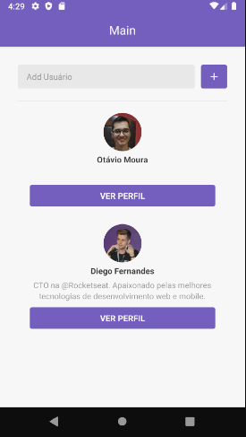

<h1 align="center">
  
</h1>

<h3 align="center">
  Desafio 6: Primeiro projeto com React Native
</h3>

## Sobre o desafio 6

Aplicação criada para o [Desafio 06](https://github.com/Rocketseat/bootcamp-gostack-desafio-06/blob/master/README.md#desafio-06-aplica%C3%A7%C3%A3o-com-react-native) do Bootcamp GoStack da Rocketseat.

A aplicação consiste em adicionar usuários presentes no github e armazenar as informações na memória do dispositivo, para isso, foi utilizado a API do github. Nos detalhes de cada usuário, são exibidos os repositórios marcados com star, clicando em um repositório, é possível visualizar a página do github em um webView.

### Print da Aplicação

## Licença

Esse projeto está sob a licença MIT. Veja o arquivo [LICENSE](LICENSE) para mais detalhes.
